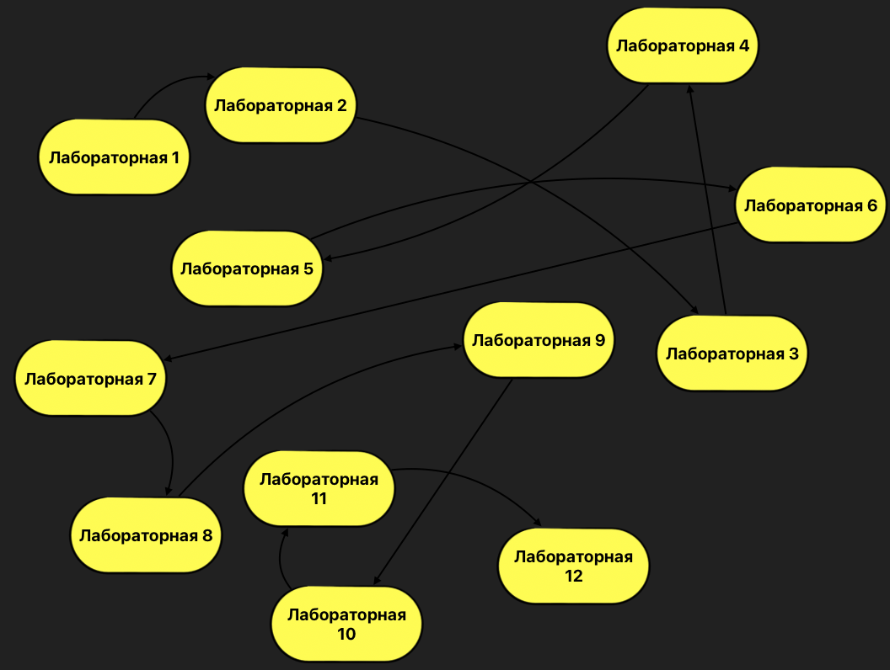

# Практики:

- [x] [Лабораторная 1](lab_01)

>1)Откройте PyCharm IDE. Изучите основные возможности среды разработки и ее основные настройки.

>2)Напишите первую программу, выводящую сообщение «Привет, мир!».

>3)Изучите команды работы с Git.

>4)Создайте свой репозиторий на GitHub.

>5)Загрузите туда свой первый проект.

- [x] [Лабораторная 2](lab_02)
> Практическое занятие 2. Условные операторы.
Решите следующие задачи, используя условные операторы.
> 1) При регистрации на сайтах требуется вводить пароль дважды. Это сделано для безопасности, поскольку такой подход уменьшает возможность неверного ввода пароля. Напишите программу, которая сравнивает пароль и его подтверждение. Если они совпадают, то программа выводит: «Пароль принят», иначе: «Пароль не принят». 
> 2) Напишите программу, которая определяет, какой тип места в плацкартном вагоне (верхнее или нижнее, в купе или боковое) по заданному номеру места. 
> 3) Год является високосным, если его номер кратен 4, но не кратен 100, или если он кратен 400. Напишите функцию, которая определяет, является ли год с данным номером високосным. Если год является високосным, то выведите «Год ... - високосный», где вместо многоточия выведите год, иначе выведите «Это год не високосный». 
> 4) Красный, синий и желтый называются основными цветами, потому что их нельзя получить путем смешения других цветов. При смешивании двух основных цветов получается вторичный цвет:
> Напишите программу, которая считывает названия двух основных цветов для смешивания. Если пользователь вводит что-нибудь помимо названий «красный», «синий» или «желтый», то программа должна вывести сообщение об ошибке. В противном случае программа должна вывести название вторичного цвета, который получится в результате.

- [x] [Лабораторная 3](lab_03)
- [x] [Лабораторная 4](lab_04)
- [x] [Лабораторная 5](lab_05)
- [x] [Лабораторная 6](lab_06)
- [x] [Лабораторная 7](lab_07)
- [x] [Лабораторная 8](lab_08)
- [x] [Лабораторная 9](lab_09)
- [x] [Лабораторная 10](lab_10) 
- [x] [Лабораторная 11](lab_11)
- [x] [Лабораторная 12](lab_12)

  
   

